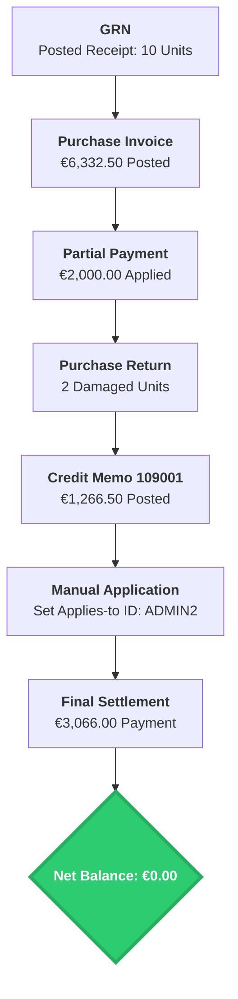
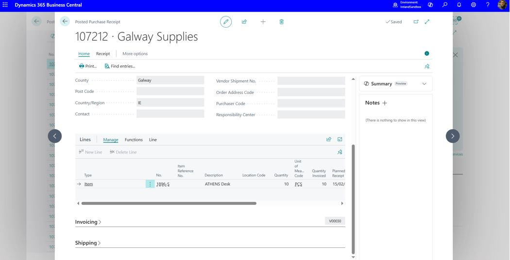
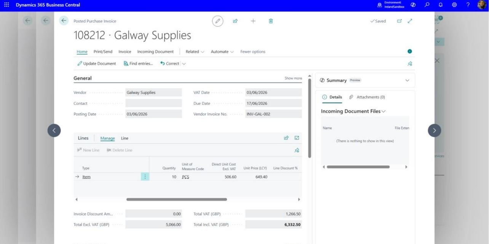
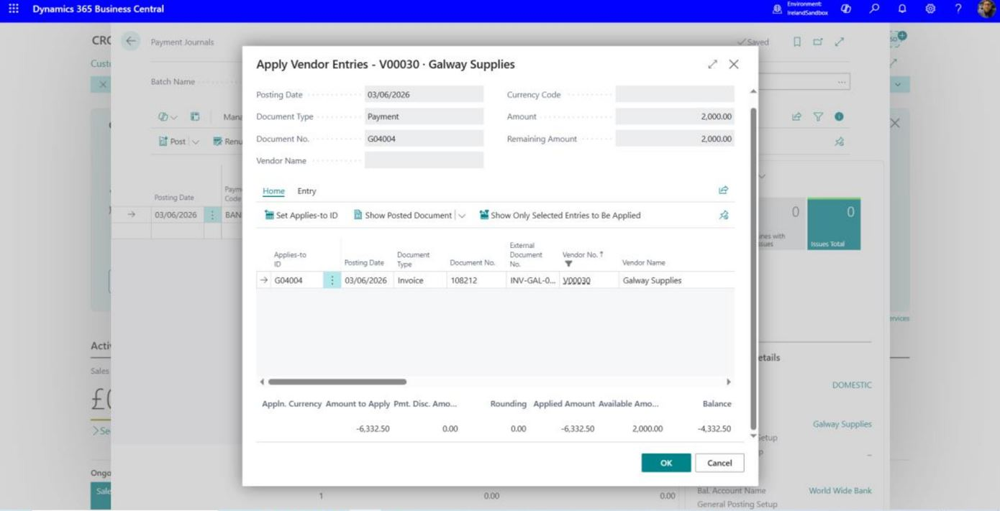
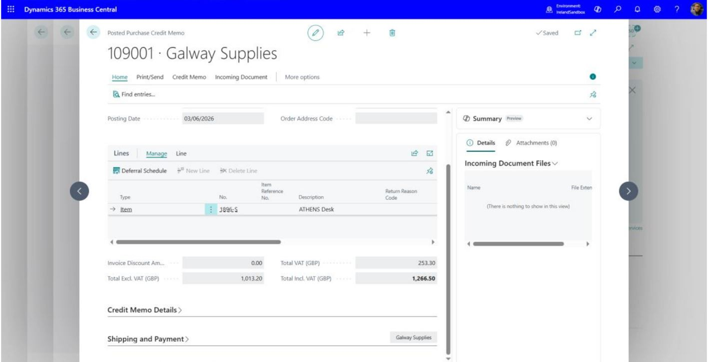
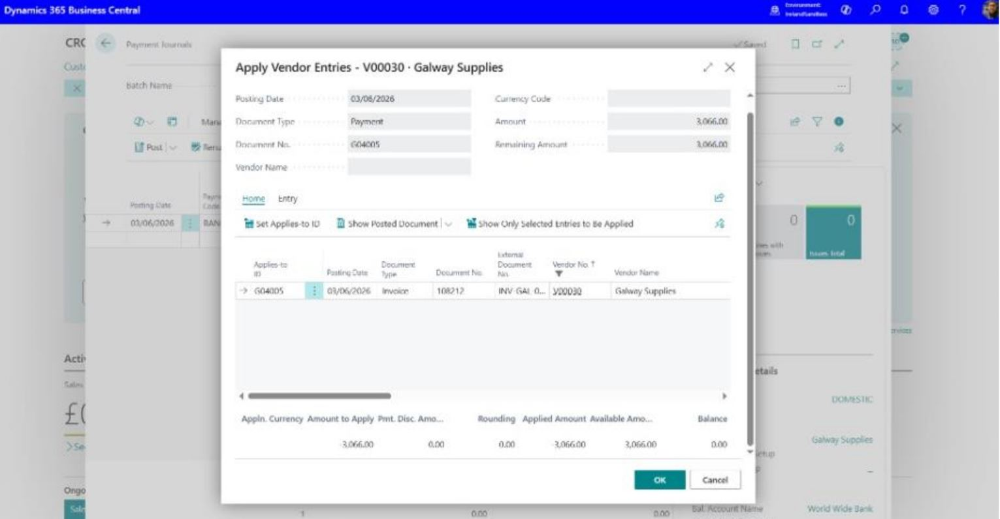
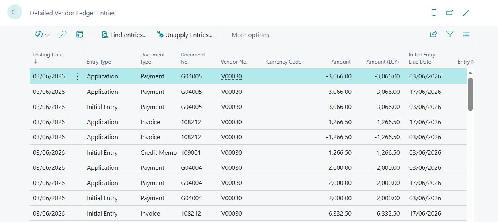
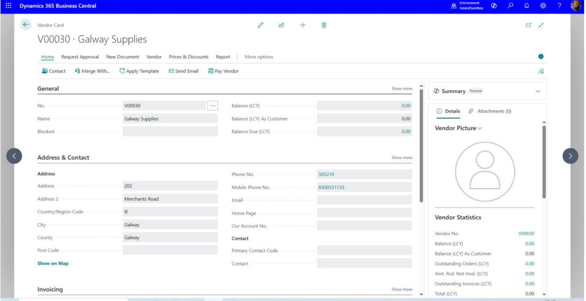

# Case Study: Complex Procure-to-Pay (P2P) Lifecycle & Financial Reconciliation
**Platform:** Microsoft Dynamics 365 Business Central
**Vendor:** Galway Supplies (V00030)

## 📌 Business Scenario
This project demonstrates a non-linear procurement cycle involving inventory receipt, partial financial settlement, exception handling (damaged goods return), and complex sub-ledger reconciliation to achieve a zero-balance audit trail.

---

## 📊 Process Flow (Mermaid.js)

---

## 🛠️ Step-by-Step Execution & Troubleshooting

### Step 0: Goods Receipt Note (GRN)

* **Functional Insight:** Documented the physical receipt of 10 ATHENS Desks.
* ***Troubleshooting:** Resolved location-based posting errors to update inventory.*

### Step 1: Posted Purchase Invoice

* **Functional Insight:** Posted Invoice 108212 for €6,332.50.

### Step 2: Partial Payment Application

* **Functional Insight:** Recorded a €2,000 partial payment.

### Step 3: Purchase Return (Credit Memo)

* **Functional Insight:** Processed a return for 2 damaged units.

### Step 4: Sub-Ledger Manual Reconciliation

* **Functional Insight:** Linked Credit Memo to Invoice using 'Applies-to ID'.

### Step 5: Detailed Vendor Ledger (Audit Trail)

* **Functional Insight:** Full history of ledger movements.

### Step 6: Final Settlement & Verification

* **Functional Insight:** Verified the final Vendor Card balance as 0.00.

---
**Author:** Hasan Farooqui
