# Case Study: Complex Procure-to-Pay (P2P) Reconciliation
**Platform:** Dynamics 365 Business Central  
**Focus:** Lifecycle Management, Partial Payments, Purchase Returns, and Sub-ledger Application.

## 📌 Project Overview
This project demonstrates the handling of a non-linear procurement cycle. It covers the end-to-end process from initial debt creation to final settlement, including handling real-world exceptions like damaged goods and manual ledger reconciliation.

---

## 📊 Process Logic (Mermaid Flowchart)

```mermaid
graph TD
    A[<b>Vendor Setup</b><br/>Galway Supplies V00030] --> B[<b>Purchase Invoice</b><br/>10 Units @ €6,332.50]
    B --> C[<b>Partial Payment</b><br/>€2,000.00 Posted]
    C --> D[<b>Remaining Balance</b><br/>€4,332.50]
    D --> E[<b>Purchase Return</b><br/>2 Damaged Units Reversal]
    E --> F[<b>Credit Memo 109001</b><br/>Value: €1,266.50]
    F --> G[<b>Manual Application</b><br/>Applying CM to Invoice]
    G --> H[<b>Final Settlement</b><br/>Payment of €3,066.00]
    H --> I{<b>Net Balance: €0.00</b>}
    style I fill:#00ff00,stroke:#333,stroke-width:4px
```

---

    🛠️ Step-by-Step Implementation
1. Initial Purchase & Partial Payment
The cycle began with a bulk purchase. To manage cash flow, a partial payment of €2,000 was recorded against the total invoice of €6,332.50.

Key Learning: Managing remaining amounts in Vendor Ledger Entries.

2. Handling Purchase Returns (Credit Memo)
Upon inspection, 2 units were found damaged. I processed a Purchase Return Order using "Exact Cost Reversing" to ensure inventory valuation remained accurate.

Outcome: Generated Posted Credit Memo 109001 for €1,266.50.

3. Manual Ledger Application (Conflict Resolution)
A critical step was manually linking the Credit Memo to the open Invoice. By using the 'Set Applies-to ID' feature, I reconciled the sub-ledger to reflect the true outstanding balance of €3,066.00.

Error Handled: Resolved "Missing Applies-to ID" during posting to ensure audit trail integrity.

4. Final Settlement
Final payment was executed via the Payment Journal, successfully bringing the vendor's balance to €0.00.

---

📁 Evidence of Work (Screenshots)
Images can be found in the /Screenshots folder of this repository.

Credit Memo Posting: Shows the reversal of damaged goods.

Application Success: Verification of the ledger link.

Final Vendor Card: Proof of zero outstanding balance.
