# Case Study: Complex Procure-to-Pay (P2P) Lifecycle & Financial Reconciliation
**Platform:** Microsoft Dynamics 365 Business Central
**Vendor:** Galway Supplies (V00030)

## 📌 Business Scenario
This project demonstrates a non-linear procurement cycle involving inventory receipt, partial financial settlement, exception handling (damaged goods return), and complex sub-ledger reconciliation to achieve a zero-balance audit trail.

---

## 📊 Process Flow (Mermaid.js)

```mermaid
graph TD
    A[<b>GRN</b><br/>Posted Receipt: 10 Units] --> B[<b>Purchase Invoice</b><br/>€6,332.50 Posted]
    B --> C[<b>Partial Payment</b><br/>€2,000.00 Applied]
    C --> D[<b>Purchase Return</b><br/>2 Damaged Units]
    D --> E[<b>Credit Memo 109001</b><br/>€1,266.50 Posted]
    E --> F[<b>Manual Application</b><br/>Set Applies-to ID: ADMIN2]
    F --> G[<b>Final Settlement</b><br/>€3,066.00 Payment]
    G --> H{<b>Net Balance: €0.00</b>}
    style H fill:#2ecc71,stroke:#27ae60,stroke-width:4px,color:#fff
```

---

🛠️ Step-by-Step Execution & Troubleshooting
Step 0: Goods Receipt Note (GRN)
Functional Insight: Documented the physical receipt of 10 ATHENS Desks. This validates the inventory increase before financial processing.

Troubleshooting: Initially, the 'Location Code' was missing on the PO line. I resolved this by updating the line details to ensure stock hit the correct warehouse.

Step 1: Posted Purchase Invoice
Functional Insight: Posted Invoice 108212 for €6,332.50, establishing the formal accounts payable liability.

Troubleshooting: Resolved a 'General Posting Setup' error by verifying the combination of Gen. Bus. Posting Group (Vendor) and Gen. Prod. Posting Group (Item).

Step 2: Partial Payment Application
Functional Insight: Recorded a €2,000 partial payment via Payment Journal, specifically applying it to the invoice to track remaining principal accurately.

Step 3: Purchase Return (Credit Memo)
Functional Insight: Processed a return for 2 damaged units. Used 'Exact Cost Reversing' to maintain inventory valuation integrity.

Troubleshooting: Handled the 'Exact Cost Reversing Mandatory' validation by using the 'Get Posted Document Lines to Reverse' function.

Step 4: Sub-Ledger Manual Reconciliation
Functional Insight: Manually linked the Credit Memo to the original Invoice to reduce the net debt before final payment.

Troubleshooting: Resolved the 'Specify an entry in Applies-to ID' error by using the 'Set Applies-to ID' function (ID: ADMIN2) to create the link between documents.

Step 5: Detailed Vendor Ledger (Audit Trail)
Functional Insight: A comprehensive audit view showing the lifecycle of the debt—from initial invoice to partial payment, credit memo adjustment, and final closure.

Step 6: Final Settlement & Verification
Functional Insight: After the final payment of €3,066.00, verified the Vendor Card to confirm a 0.00 remaining balance.

Author: Hasan Farooqui

Business Central Functional Consultant Portfolio
