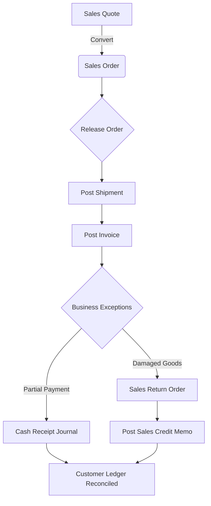

# 02-Order-to-Cash (O2C): Mixed Fulfillment & Business Exceptions

## 📌 Project Overview
This project demonstrates a high-complexity **Order-to-Cash (O2C)** cycle within Microsoft Dynamics 365 Business Central. The scenario goes beyond a standard flow to showcase how a Functional Consultant handles real-world business hurdles such as service-based billing, partial payments, and sales returns.

### 🏢 Client Scenario: Dublin Office Solutions
* **The Deal:** A sale of 5x ATHENS Desks plus 5 hours of professional 'Office Setup' services.
* **The Complexity:** 1. **Service vs. Product:** Managing physical inventory alongside non-stock service hours.
    2. **Partial Payment:** Handling a scenario where the customer pays a round sum (£2,000) against a £4,949.38 invoice.
    3. **Sales Return:** Processing a 'Damaged in Transit' return for 1 unit and issuing a Credit Memo.

---

## 🔄 Process Flowchart
The following diagram illustrates the lifecycle of this O2C transaction, including the pivot point where business exceptions (Payments & Returns) were handled.

## 🛠 Step-by-Step Execution

### Step 1: Master Data & Item Configuration
Configured a **Service-Type Item** (Office Setup) to track professional labor hours. This ensures revenue is recognized without impacting physical warehouse counts.
> 

### Step 2: Sales Quote & Entry
Created the initial quote for the customer, applying a 5% discount to the service line to secure the deal.
> 

### Step 3: Sales Order Release
Converted the quote to a Sales Order and **Released** it. This step locks the order and signals the warehouse that items are ready for fulfillment.
> 

### Step 4: Revenue Recognition (Invoicing)
Generated the **Posted Sales Invoice**. This step recognizes the revenue in the General Ledger and creates the initial Accounts Receivable entry.
> 

### Step 5: Partial Payment Application
Recorded a **£2,000 partial payment** via the Cash Receipt Journal. The ledger validates that the payment was applied, leaving the remaining balance open.
> 

### Step 6: Handling Sales Returns
Managed the return of 1 damaged unit. I utilized the **'Get Posted Document Lines to Reverse'** feature to ensure 100% audit traceability back to the original invoice.
> 

### Step 7: Credit Memo Issuance
Posted the return to generate a **Sales Credit Memo**, formally reducing the customer's debt and returning the item to inventory.
> 

### Step 8: Final Financial Reconciliation
The "Single Source of Truth." The Customer Ledger Entries now reflect the full lifecycle: **Invoice → Partial Payment → Credit Memo → Final Balance (£2,137.63).**
> 

---

## 💡 Functional Skills Demonstrated
* **Financial Management:** Partial payment application and sub-ledger reconciliation.
* **Logistics Handling:** Sales returns and inventory restocking procedures.
* **Audit & Traceability:** Using reversal functions to maintain document links.
* **Ireland Localization:** Configuring VAT and posting groups for the IE (Ireland) region.

---

## ⚙️ Technical Configuration Summary

| Feature | Configuration Detail | Purpose |
| :--- | :--- | :--- |
| **Customer Posting Group** | DOMESTIC | Maps the receivable to the correct G/L Control Account. |
| **Gen. Bus. Posting Group** | DOMESTIC | Determines the Revenue/COGS accounts for Irish transactions. |
| **VAT Bus. Posting Group** | DOMESTIC | Applies the standard 23% Irish VAT rate. |
| **Item Type** | Service | Used for 'Office Setup' to bypass inventory movements. |
| **Application Method** | Manual | Allows precise linking of the £2,000 payment to the specific invoice. |
| **Exact Cost Reversing** | Enabled | Ensures the Sales Return is valued at the original sales price. |
