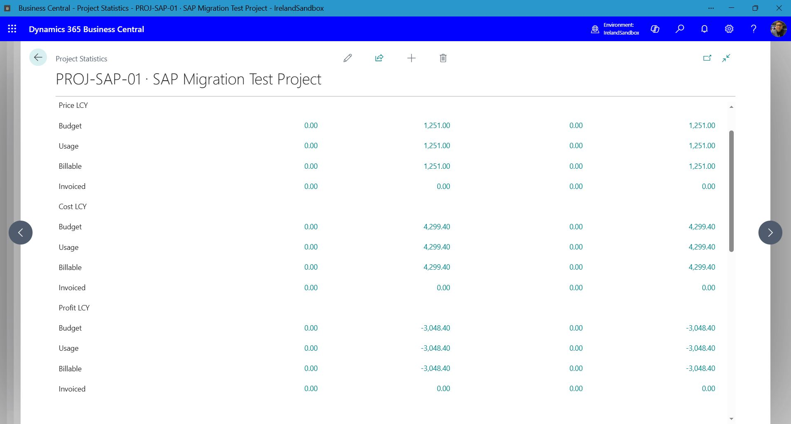
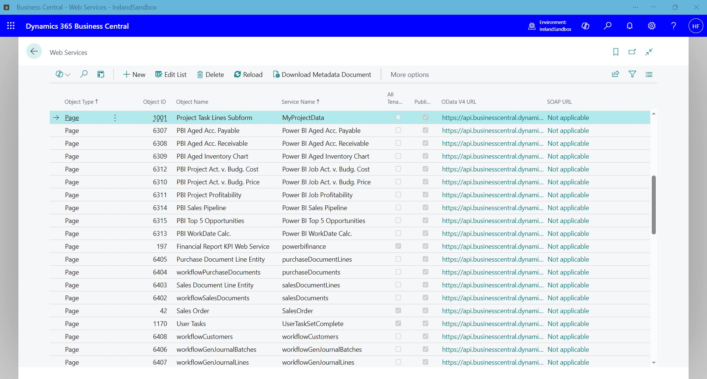
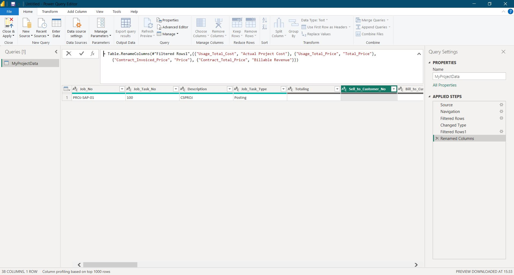
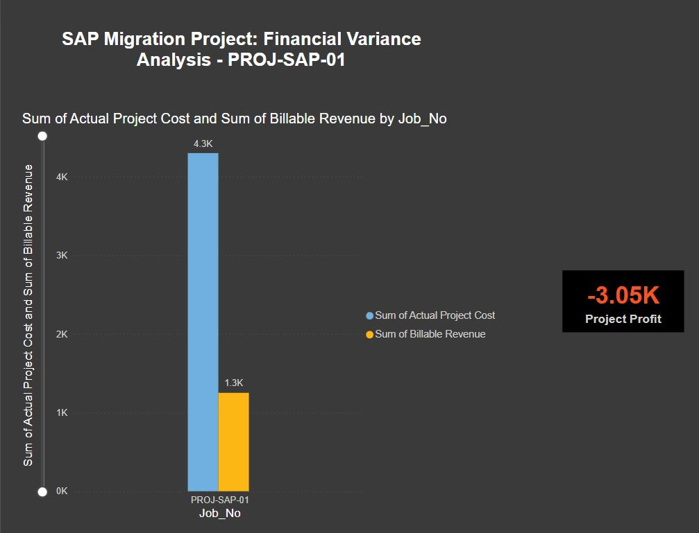

# Case Study: ERP Financial Intelligence & Data Visualization
**Platform:** Microsoft Dynamics 365 Business Central & Power BI  
**Region:** Ireland (VAT/VIES Compliant)

## Objective
Bridge the gap between raw ERP accounting data and executive-level decision-making by visualizing a high-variance SAP-to-BC migration project.

---

## Technical Workflow

### 1. ERP Configuration & Source Data
Managed project ledger entries and VAT settlement within the **Ireland Sandbox** to ensure financial accuracy for multi-currency transactions.

*Figure 1: Business Central Project Statistics showing the initial financial baseline.*

### 2. Data Engineering & Connectivity
Established a secure **OData V4 web service** connection between Business Central and Power BI Desktop. This live bridge ensures that any financial updates in the ERP are reflected in the report instantly.

*Figure 2: Configuring OData V4 endpoints for real-time data streaming.*

### 3. ETL & Data Modeling
Applied **Power Query** transformations to clean raw tables. I authored custom DAX measures to calculate real-time Project Profit/Loss, effectively turning complex ledger entries into actionable metrics.

*Figure 3: Data transformation and DAX modeling in the Power BI engine room.*

### 4. BI Visualization & Insight
Developed a high-contrast financial dashboard designed for rapid risk identification. 
- **Clustered Column Charts:** Visualizing the massive gap between Budget and Actuals.
- **Conditional KPI Formatting:** Instant visual cues for financial loss.

*Figure 4: The final executive dashboard highlighting a 243% cost overrun.*

---

## Key Result
Identified a **243% cost overrun** ($4,299.40 actual vs. $1,251.00 billable), enabling stakeholders to pivot project resources and perform a post-mortem audit on migration costs.
